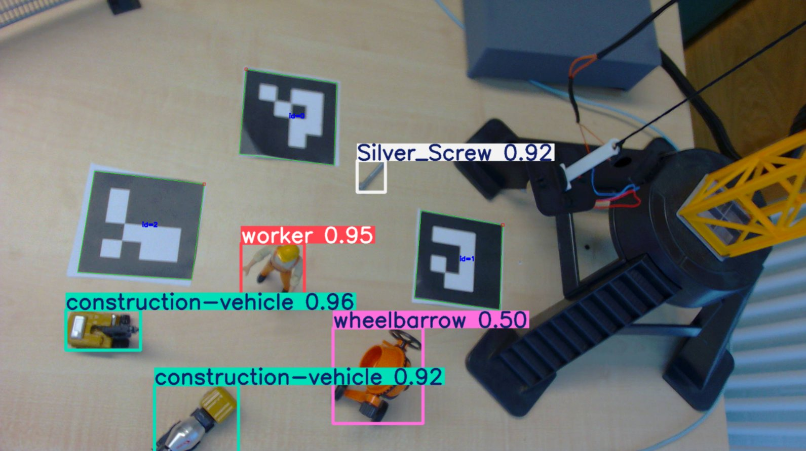
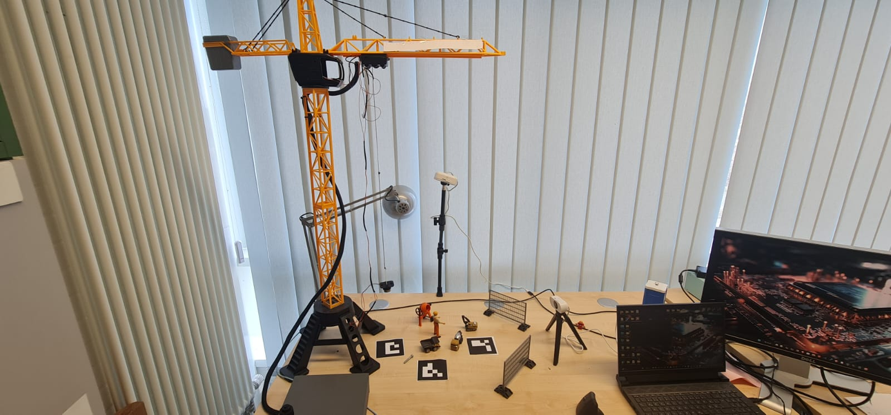
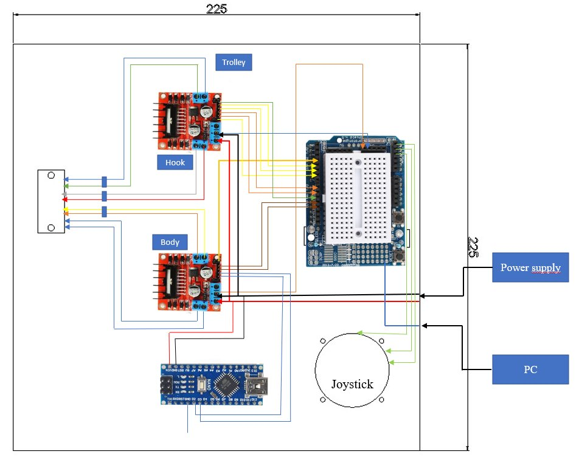
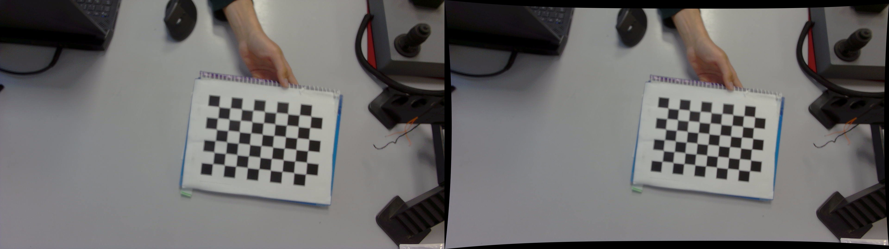

# AI-Controlled Tower Crane Automation

**A model tower crane you control with plain language.** It sees its workspace through a single overhead camera, works out where everything is in real centimeters, plans a safe path, and refuses to move through a person even if you tell it to. The reasoning is done by a Large Language Model (LLM); the safety is done in code.

This is the practical part of my Master's thesis at TU Clausthal (Chair of Intelligent Automation Systems, supervised by Prof. Dr. Stefan Palis).



## Why this project

I work on **Physical AI**: making real hardware act intelligently through vision, learning, and embedded control. This crane is one full example of that idea. I built it by myself, from wiring the motor drivers to writing the firmware and the vision and control software, then connected a language model on top so the whole thing can be operated with a sentence like "move the load to Station B."

### Highlights

- **Natural language control.** An LLM drives the crane through four safe tools exposed over the Model Context Protocol (MCP).
- **Single overhead camera vision.** YOLOv8 with six detection classes finds objects, ArUco markers (DICT_4X4_50) fix the stations and origin, and a homography turns pixels into real centimeters.
- **Safety in code, not in the model.** A path checker blocks any move that passes too close to a worker or obstacle. The crane will not crush the figure even when asked to.
- **Fault-tolerant hardware.** Control is split across two microcontrollers, so the crane stays in a safe state even if one resets.
- **Built end to end, solo.** Mechanics, electronics, C++ firmware, Python vision and control.



### See it in action

You scan the table, then ask the crane to go somewhere. If the direct route is unsafe, it says so and finds another way:

> **You:** move to Station B
> **Crane:** The direct path to Station B is blocked by the worker at (8.6, -2.1). Routing around them.
> **Crane:** Clear path going south. Now swinging east, then up to Station B.
> **Crane:** Arrived at Station B (19.0, -1.4).

The worker never gets run over, because that rule lives in `navigator.py`, not in the model's good intentions.

---

## Table of contents

1. [How it works, step by step](#how-it-works-step-by-step)
2. [Hardware and electronics](#hardware-and-electronics)
3. [Repository structure](#repository-structure)
4. [Quick start: run the existing crane](#quick-start-run-the-existing-crane)
5. [Software setup](#software-setup)
6. [Connecting to Claude (the LLM brain)](#connecting-to-claude-the-llm-brain)
7. [Camera calibration and homography](#camera-calibration-and-homography)
8. [Live test tools](#live-test-tools)
9. [Serial command protocol](#serial-command-protocol)
10. [Known limits and things to edit first](#known-limits-and-things-to-edit-first)
11. [Version note and roadmap](#version-note-and-roadmap)
12. [License, author, contact](#license-author-contact)

---

## How it works, step by step

The vision and control pipeline has four parts.

### 1. YOLOv8: finding the objects

YOLO ("You Only Look Once") is an object detection model. You give it an image and it returns boxes around the things it recognizes, with a class name and a confidence score from 0 to 1.

In this project YOLO is **not trained from scratch**. A custom model (`yolo_model.pt`) was trained earlier on photos of the model construction site, and here it is only used for detection. It knows six classes, including the worker and the obstacle types. The code keeps a detection only if its confidence is above 0.45. For each kept box, the center pixel is taken as the object position.

### 2. ArUco markers: finding the stations and the origin

ArUco markers are small black and white squares, like simple QR codes. Each one has an ID number, and they are more exact to locate than a YOLO box, so they mark the fixed points:

- **ID 0** is the origin, the point that means (0, 0).
- **ID 1** is Station A.
- **ID 2** is Station B.

The marker center is the average of its four corners.

### 3. Homography: turning pixels into centimeters

The camera looks at the table from an angle, so the table appears as a trapezoid, not a clean rectangle. A homography is a 3x3 matrix that maps a point in the image to a point on the flat table plane. You measure a few known points with a ruler, compute the matrix once, and reuse it. After that, any pixel `(u, v)` becomes table coordinates `(x_cm, y_cm)` with one call to `cv2.perspectiveTransform`. Lens distortion is removed first (see calibration), then the homography is applied.

### 4. MCP and the LLM: the brain

[MCP (Model Context Protocol)](https://modelcontextprotocol.io) is the bridge between the Python code and the language model. `server.py` exposes four tools:

- `scan_environment` returns the detected objects with their centimeter coordinates.
- `move_crane(x, y)` rescans for obstacles, then moves to a target while avoiding them.
- `operate_hook(action, duration)` raises or lowers the hook.
- `toggle_magnet(state)` turns the electromagnet on or off.

The LLM reads the scan, reasons about the layout, and calls these tools. The text written under each tool in `server.py` is what the model reads to understand it, so those descriptions are part of the program, not just comments.

### The safety layer

Path checking lives in `navigator.py`. For each move it tries two L-shaped paths ("Y then X" and "X then Y") and measures the shortest distance from every obstacle to the path line. If any obstacle is closer than `OBSTACLE_RADIUS + SAFETY_MARGIN`, that path is rejected. If both are blocked, the crane stops and reports the blocker.

---

## Hardware and electronics

| Part | Role |
|------|------|
| Arduino Uno | Main controller. Reads serial commands, drives three DC motors through L298N boards, runs the joystick, talks to the Nano. Serial at 115200 baud. |
| Arduino Nano | Controls the electromagnet through its own L298N. Listens to the Uno over SoftwareSerial at 9600 baud. Keeps the magnet holding even if the Uno reboots. |
| 3x DC motors + L298N | Body rotation, trolley, and hook. |
| Electromagnet | QUARKZMAN 5V DC 50N, 25x20 mm, in a 3D printed housing. Picks up steel parts. |
| Camera 1 (overhead) | Elgato Facecam Neo, top view. The main camera for YOLO, ArUco, and the homography. |
| Camera 2 (table level) | Side view, used only for the test tool. |
| Analog joystick | Manual control when the AI is not driving (X = trolley, Y = hook, Z = body). |

### Wiring

The full wiring of the control box is in the schematic: the Arduino Uno on a sensor shield, the three L298N drivers (Trolley, Hook, Body), the Arduino Nano for the magnet, the joystick, and the power and PC connections.



- Uno to Nano over SoftwareSerial: **Uno A5 (TX) to Nano D10 (RX)**, with a common ground.
- Magnet protocol between Uno and Nano is a single character: `'1'` on, `'0'` off.
- Pin assignments are at the top of `arduino/for_crane_project/for_crane_project.ino`.

---

## Repository structure

```
ai-crane-automation/
  README.md
  requirements.txt
  .gitignore

  controller.py              Serial link to the Arduino Uno
  detector.py                Camera + YOLO + ArUco + homography
  navigator.py               Path planning and obstacle avoidance
  server.py                  MCP server, exposes the tools to the LLM

  live_test.py               Overhead camera viewer (YOLO + ArUco overlay)
  live_test_for_camera2.py   Side camera viewer (ArUco pose relative to ID 10)

  calibrate_camera.py        Lens calibration from checkerboard photos
  calibrate_homography.py    Builds the pixel to cm matrix from 4 markers
  use_calibration.py         Helper functions used by detector.py

  calibration_cam1.npz       Camera 1 lens calibration (included)
  calibration_cam1.json      Same data in readable form (included)
  homography_cam1.npy        Camera 1 pixel to cm matrix (included)
  yolo_model.pt              Trained YOLOv8 weights (6 classes)

  arduino/
    for_crane_project/for_crane_project.ino       Arduino Uno sketch
    for_nano_crane_magnet/for_nano_crane_magnet.ino  Arduino Nano sketch

  docs/
    yolo_detection.png        The vision system in action
    crane_setup.jpg           The physical rig
    schematic.png             Control box wiring
    comparison_cam1.jpg        Before/after lens undistortion, Camera 1
    comparison_cam2.jpg        Before/after lens undistortion, Camera 2
    undistorted_cam1.jpg       Undistorted sample, Camera 1
    undistorted_cam2.jpg       Undistorted sample, Camera 2
    homography_cam1_reference.jpg  Frame used to build the homography
```

Each `.ino` sits inside a folder of the same name, because the Arduino IDE requires it. Open the folder, not the file.

---

## Quick start: run the existing crane

If you have **this physical crane with the overhead camera in its mounted position**, the repo already contains the trained model, the lens calibration, and the homography, so you do not need to recalibrate. The full path is:

1. Install the software (next section).
2. Upload the two Arduino sketches (Uno and Nano).
3. Set the COM port in `controller.py` and check the camera index in `detector.py` and `server.py`.
4. Install Claude Desktop and point it at `server.py` (the section after next).
5. Open Claude Desktop and tell the crane what to do.

If you move the camera or change the table, redo the homography step (it takes a few minutes), because the pixel-to-cm map depends on the camera position.

---

## Software setup

Tested on Windows with Python 3.11. A virtual environment ("venv") is a private package folder for one project, so these libraries do not affect your other Python work.

**1. Install Python 3.11** from [python.org](https://www.python.org/downloads/). Tick **"Add python.exe to PATH"** during install.

**2. Open a terminal in the project folder.**

```bat
cd path\to\ai-crane-automation
```

**3. Create and activate the virtual environment.**

```bat
python -m venv venv
venv\Scripts\activate
```

In PowerShell use `venv\Scripts\Activate.ps1`. When active you will see `(venv)` at the start of the line.

**4. Update pip and install the packages.**

```bat
python -m pip install --upgrade pip
pip install -r requirements.txt
```

`requirements.txt`:

```
ultralytics
opencv-contrib-python
numpy
pyserial
mcp
```

Three things that often trip people up:

- `ultralytics` installs YOLOv8 and pulls in PyTorch (CPU build). YOLOv8 runs fine on CPU, just slower than GPU.
- Use **opencv-contrib-python**, not plain `opencv-python`, because the code uses `cv2.aruco`. Do not install both. If `ultralytics` already pulled in `opencv-python`, run `pip uninstall opencv-python` then `pip install opencv-contrib-python`.
- `pyserial` installs under that name but is imported as `serial`. Normal, not an error.

**5. Check that the key libraries load.**

```bat
python -c "import cv2.aruco; print('aruco ok')"
python -c "from ultralytics import YOLO; YOLO('yolo_model.pt'); print('yolo ok')"
```

Run the second command from the folder that holds `yolo_model.pt`.

---

## Connecting to Claude (the LLM brain)

The crane is driven by an LLM through the MCP server in `server.py`. The simplest client is the free Claude Desktop app, which can launch the server and read its four tools.

**1. Download and install Claude Desktop** from [claude.ai/download](https://claude.ai/download) (Windows and macOS). Open it and sign in with a Claude account.

**2. Open the configuration file.** In Claude Desktop go to **Settings > Developer > Edit Config**. This opens (or creates) a file named `claude_desktop_config.json`. Its location is:

- Windows: `%APPDATA%\Claude\claude_desktop_config.json`
- macOS: `~/Library/Application Support/Claude/claude_desktop_config.json`

**3. Add this crane server.** Paste the block below. Use **absolute paths**, and point `command` at the Python inside your venv so all the libraries are available. Replace the example paths with your own.

```json
{
  "mcpServers": {
    "crane": {
      "command": "C:\\Users\\YOUR_NAME\\ai-crane-automation\\venv\\Scripts\\python.exe",
      "args": ["C:\\Users\\YOUR_NAME\\ai-crane-automation\\server.py"]
    }
  }
}
```

On macOS the paths look like `/Users/YOUR_NAME/ai-crane-automation/venv/bin/python` and `/Users/YOUR_NAME/ai-crane-automation/server.py`. If the file already has other servers, add `"crane"` next to them inside `mcpServers` and keep the commas valid.

**4. Restart Claude Desktop completely.** Quit the app fully (not just the window; use the system tray or Task Manager), then open it again. Config changes only load on a fresh start.

**5. Check the tools appeared.** In a new chat you should see the crane's tools available (a tools or connector icon). Then just type a command:

```
Scan the table and tell me what you see.
Pick up the screw and move it to Station B.
```

**Troubleshooting.** Most problems are one of: a path that is not absolute, the venv Python not used (so a library is missing), or the app not fully restarted. JSON is strict about commas and brackets, so check the syntax. Server error logs are in `%APPDATA%\Claude\logs` on Windows (look for `mcp-server-crane.log`) and `~/Library/Logs/Claude` on macOS. To test the server on its own first, run `python server.py` inside the venv and check it starts without errors.

> Note: Claude Desktop is also adding a one-click "Extensions" way to install local servers. The JSON method above is the most reliable for a custom server like this one, because it lets you choose the exact Python and paths.

---

## Camera calibration and homography

Turning what the camera sees into accurate centimeters takes two steps. Camera 1's files are already included, so you only redo this if you change the camera or table.

### Step 1: Lens calibration

A lens bends straight lines, more near the frame edges. `calibrate_camera.py` measures this from photos of a printed checkerboard and lets us undo it. Take 15 to 20 photos of the board from different angles, then:

```bat
python calibrate_camera.py --folder path\to\photos --camera cam1 --square-size 22
```

It saves `calibration_cam1.npz` and a readable `calibration_cam1.json`. For Camera 1 here the result was about 1.2 pixels RMS error over 95 images (see `calibration_cam1.json`), a good fit for a webcam. The left/right effect is visible below: left is raw, right is undistorted.



### Step 2: Homography

After the lens is fixed, the table is still seen at an angle. `calibrate_homography.py` maps undistorted pixels to centimeters using four ArUco markers (IDs 0, 1, 2, 3) whose centers you measured with a ruler. Place the markers, run the script, and press SPACE when all four are detected:

```bat
python calibrate_homography.py --camera-index 1
```

It matches each marker corner to its real position and computes the matrix with `cv2.findHomography`, then validates it against your ruler measurements. The included `homography_cam1.npy` maps the four reference markers back to within about half a centimeter on average. The frame used is saved as `docs/homography_cam1_reference.jpg`.

---

## Live test tools

These two scripts let you see exactly what the camera sees, without the LLM or the crane. They were very useful while building and debugging the vision part.

- **`live_test.py`** opens the overhead camera and draws the YOLO boxes and ArUco markers on the live video. This is what I used to confirm the model detects the worker, the vehicles, and the markers, and to tune the 0.45 confidence threshold.
- **`live_test_for_camera2.py`** opens the side camera and shows each marker's position in centimeters relative to marker ID 10.

Run either and press `q` to close the window.

```bat
python live_test.py
```

---

## Serial command protocol

Python sends short ASCII commands to the Uno, wrapped between `<` and `>`.

| Command | Meaning |
|---------|---------|
| `<J,body,hook,trolley,duration_ms>` | Drive the three motors at the given speeds for the given time in milliseconds. |
| `<M,1>` / `<M,0>` | Magnet on / magnet off. The Uno relays `'1'` or `'0'` to the Nano. |
| `<S>` | Emergency stop. Halts all motors and drops the magnet. |

The Uno replies with `<Ready>`, `<ACK>`, `<DONE>`, `<MAGNET_ON>`, `<MAGNET_OFF>`, and `<STOPPED>`. Motor timing uses `millis()` instead of `delay()`, so the board can still read new commands while a move runs.

---

## Known limits and things to edit first

Honest notes about the rough edges.

- **COM port is hardcoded.** `controller.py` uses `COM10`. Change it to your port.
- **Camera index is assumed.** `detector.py` uses index 0 and `server.py` uses index 1 then 0. Change if your camera is elsewhere.
- **The fence is not treated as an obstacle.** In `server.py`, `DANGER_OBJECTS` lists `"Fence"` with a capital F, but the check lowercases the detected name, so a detected fence becomes `"fence"` and never matches. Worker, construction vehicle, and wheelbarrow work correctly. The one character fix is `"Fence"` to `"fence"`. Left as is to match the thesis state.
- **Movement is open loop and time based.** Motors run for a calculated number of milliseconds at a measured cm per second. There is no encoder feedback, so position drifts over many moves. This is a main reason for the move to stepper motors.
- **The path planner only tries two L-shaped routes.** In a tight cluster of obstacles it can report a safe halt even when a longer route exists.

---

## Version note and roadmap

This repository is the **DC motor prototype** (version 1): three DC motors driven by L298N H-bridges. After this version, the crane was redesigned. The mechanical structure is being rebuilt to be more stable, and the three DC motors are being replaced with NEMA 17 stepper motors and TB6600 drivers for more accurate, repeatable positioning. The redesigned stepper version will be uploaded as a separate release once it is finished and tested, including its own schematic.

---

## License, author, contact

This code is part of an ongoing Master's thesis. Until submission, please treat it as **all rights reserved** and ask before reusing it. A formal open license will be added after submission.

**Author:** Amer El-Saad, M.Sc. Mechatronics, TU Clausthal
**GitHub:** [github.com/elsaadamer](https://github.com/elsaadamer)
**LinkedIn:** [linkedin.com/in/amerelsaad](https://linkedin.com/in/amerelsaad)
