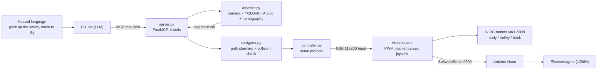

# 🏗️ AI-Controlled Tower Crane

### Physical AI: an autonomous tower crane driven by a Large Language Model and computer vision.

A single overhead camera reconstructs the workspace in real-world centimeters. A YOLOv8 model and ArUco fiducials locate every object and station. A Large Language Model plans the task in natural language and calls a control stack that drives a physical 3-DOF crane, while a safety layer in code blocks any motion that would cross a worker. The model can reason and command, but it cannot override the safety check.


---

## System architecture

The system is a four-layer stack. Perception turns camera pixels into metric coordinates, planning turns a goal into a safe route, actuation turns a route into motor pulses, and an LLM sits on top and issues high-level intent through a typed tool interface.



A single command such as "move to Station B" runs the full loop: `server.py` calls `detector.py` for a fresh scan, filters the detections into obstacles, hands them to `navigator.py`, which computes a collision-free route and streams timed motor commands through `controller.py` to the Uno.

---

## The software, module by module

The Python stack is four modules plus two Arduino sketches. Everything is written from scratch; no high-level robotics framework is used.

### `detector.py` — perception

`CraneDetector` owns the camera and the full vision pipeline. At startup it loads the lens calibration (`calibration_cam1.npz`) and precomputes the undistortion maps once with `cv2.initUndistortRectifyMap`, so each frame is rectified with a cheap `cv2.remap` rather than a full `undistort` call. It loads the homography (`homography_cam1.npy`) for the pixel-to-centimeter transform.

`scan_scene()` runs two detectors on every undistorted frame:

- **ArUco** (`DICT_4X4_50`) for the fixed frame: ID 0 is the origin, ID 1 and ID 2 are Stations A and B. Marker centers come from the mean of their four corners.
- **YOLOv8** for the movable objects, at `imgsz=1280` with a 0.45 confidence gate. Each kept box contributes its center pixel.

Every detected pixel is converted to table coordinates by `pixel_to_cm()`, a one-shot `cv2.perspectiveTransform` through the homography. The method returns a clean list of `{name, x, y}` in centimeters, which is the only thing the rest of the stack ever sees.

### `navigator.py` — planning and safety

`CraneNavigator` turns a target in centimeters into motor motion. It is deliberately open-loop and time-based: each axis has a measured speed in cm per second per direction (separate constants for trolley out and back, body positive and negative), and `_drive_axis()` converts a distance into a pulse duration in milliseconds. The current position is persisted in `crane_memory.json` so the crane keeps its estimate across sessions, and the trolley axis is clamped to physical rail limits.

The safety logic is the core of the file. `_is_collision()` models each obstacle as a circle of radius `OBSTACLE_RADIUS + SAFETY_MARGIN` and measures the shortest distance from that circle's center to a candidate path segment using a clamped projection of the point onto the line. `move_to()` builds two L-shaped candidate routes ("Y then X" and "X then Y"), checks both legs of each, and takes the first route that is clear. If both are blocked it halts and returns the name of the blocking object, which the LLM then uses to reroute.

### `controller.py` — actuation interface

A thin serial wrapper around the Arduino link. It opens the port at 115200 baud, and exposes `drive_joystick()`, `set_magnet()`, and `stop_all_motors()`, each of which formats one ASCII packet. `wait_for_done()` implements a simple handshake: it blocks until the Uno reports `<DONE>` or a timeout elapses, so Python and the firmware stay in step.

### `server.py` — the LLM interface

A `FastMCP` server that exposes exactly four tools to the model: `scan_environment`, `move_crane`, `operate_hook`, and `toggle_magnet`. The function docstrings are the tool schemas the model reads, so they are part of the contract, not comments. `move_crane` rescans before moving and filters detections through a `DANGER_OBJECTS` set, so obstacle avoidance is automatic on every move. The model only ever sees these four verbs, which keeps unsafe primitives out of its reach.

### Firmware: `for_crane_project.ino` (Uno) and `for_nano_crane_magnet.ino` (Nano)

The Uno runs a non-blocking loop. `recvWithStartEndMarkers()` assembles packets framed by `<` and `>` without blocking, and motion is timed with `millis()` rather than `delay()`, so the board keeps parsing new commands while a move is in progress. Joystick axes are read with a dead zone and mapped to PWM, and every commanded speed is clamped per axis with `constrain()`. Magnet commands are relayed to the Nano over SoftwareSerial as a single character.

The Nano does one job: drive the electromagnet through its own L298N. Splitting it onto a second microcontroller means the magnet holds its load even if the Uno resets mid-task, which is the kind of failure that would otherwise drop a part.

---

## Computer vision pipeline

Accurate metric tracking from one cheap webcam needs two correction stages before any detection is trusted.

**Lens calibration** removes the radial and tangential distortion of the lens. It was computed from 95 checkerboard images with `cv2.calibrateCamera`, reaching about 1.2 pixels RMS reprojection error. The effect is visible below: left is raw, right is undistorted, and the curved edges straighten out.


**Homography** maps the undistorted image plane to the table plane. Four ArUco markers with ruler-measured centers give the ground truth, and `cv2.findHomography` with RANSAC solves the 3x3 matrix. Validated against the measurements, it reprojects the reference markers to within about half a centimeter, which is enough to place the hook over a small part.

With both stages in place, `pixel_to_cm()` gives the planner real coordinates, so "Station B is at (19.0, -1.4)" means 19 cm along the rail and 1.4 cm across, not an arbitrary pixel.

---

## Motion planning and safety

The interesting property of this system is that the language model is not trusted with safety. When asked to move through the worker, it cannot. The geometric check in `navigator.py` rejects the path before any pulse is sent, and the only thing the model can do in response is choose a different target or wait. This separation, intelligence on top and a hard constraint underneath, is the design idea I wanted to demonstrate.

```
You:   move to Station B
Crane: Direct path blocked by the worker at (8.6, -2.1). Routing around them.
Crane: Clear path going south. Now swinging east, then up to Station B.
Crane: Arrived at Station B (19.0, -1.4).
```

---

## Electronics and control architecture


The control box holds an Arduino Uno on a prototyping shield, three L298N H-bridge drivers (trolley, hook, body rotation), an Arduino Nano for the electromagnet, and the analog joystick. Power comes from an external supply; the PC connects to the Uno over USB.

| Element | Function |
|---------|----------|
| Arduino Uno | Command parser, PWM motor driver, joystick reader, master of the serial link (115200 baud). |
| 3x L298N | H-bridges for the three DC motors, direction and speed by two direction pins plus a PWM pin each. |
| Arduino Nano | Independent electromagnet driver, listens on SoftwareSerial at 9600 baud. |
| Joystick | Manual override (X trolley, Y hook, Z body) when the AI is not in control. |

**Serial protocol** (PC to Uno, ASCII framed by `<` and `>`):

| Command | Meaning |
|---------|---------|
| `<J,body,hook,trolley,duration_ms>` | Drive the three motors at signed PWM speeds for a fixed time. |
| `<M,1>` / `<M,0>` | Magnet on / off, relayed to the Nano. |
| `<S>` | Emergency stop: all motors off, magnet released. |

The Uno acknowledges with `<Ready>`, `<ACK>`, `<DONE>`, `<MAGNET_ON>`, `<MAGNET_OFF>`, and `<STOPPED>`, which is what lets `controller.py` synchronize.


---

## Engineering notes

- **Open-loop, time-based motion** keeps the firmware simple but drifts over long sequences, since there is no encoder feedback. This is the main motivation for the next version.
- **Two microcontrollers** trade a little wiring for fault tolerance on the load-bearing magnet.
- **Vision in metric units** means the planner and the LLM reason in centimeters, not pixels, so the same code works regardless of camera resolution once calibrated.

---

## Tech stack

`Python` · `OpenCV (calibration, ArUco, homography)` · `YOLOv8 / Ultralytics` · `NumPy` · `Model Context Protocol (FastMCP)` · `Arduino C++` · `PySerial`

## Run it

The full code, the trained model, the calibration, and the homography are in this repository. Installation, the Claude Desktop / MCP configuration, and the calibration procedure are in **[SETUP.md](SETUP.md)**.

## About and roadmap

This is the practical part of my Master's thesis at TU Clausthal (Chair of Intelligent Automation Systems). This repository is the **DC motor prototype**. The crane is being rebuilt with a stiffer structure and three NEMA 17 stepper motors on TB6600 drivers, moving from open-loop timing to precise step-based positioning. That version will follow as a separate release with its own schematic.

**Amer El-Saad**, M.Sc. Mechatronics, TU Clausthal
[LinkedIn](https://linkedin.com/in/amerelsaad) · [GitHub](https://github.com/elsaadamer)
